# Hotel Reservation Manager

• the application has stored all hotels with their coordinates, rooms, and the price for each room 
in a database. The data is read from a given json file(see the json example below) 
• a hotel can have: single room , double room, suite room or matrimonial room which vary by 
price 
• the user specifies a radius in kilometers to find all the nearby hotels 
• the application lists and displays all hotels found 
• the user can select a specific hotel and see all available rooms alongside their prices 
• after this, the user can book one, or more of the available rooms 
• the application allows the user to cancel their reservation or change the booked room at least 
two hours before the check-in 

## Here are some screenshots:

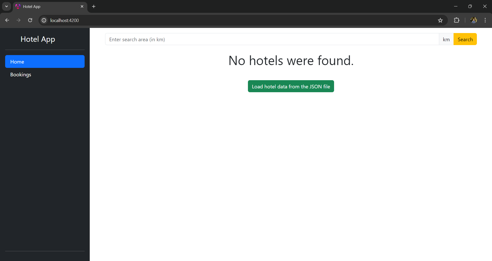
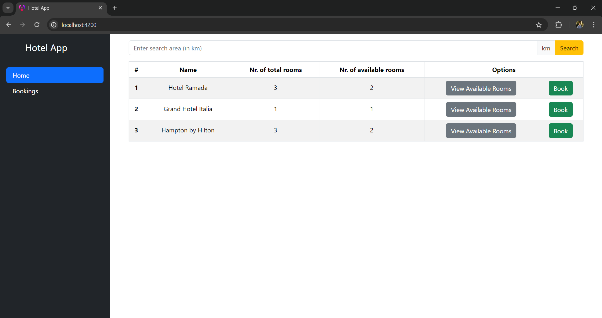
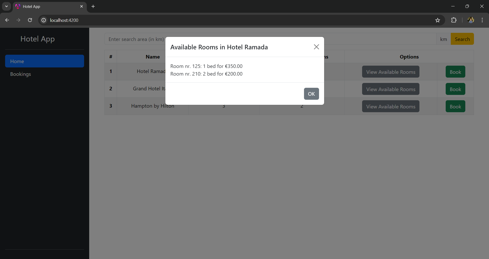
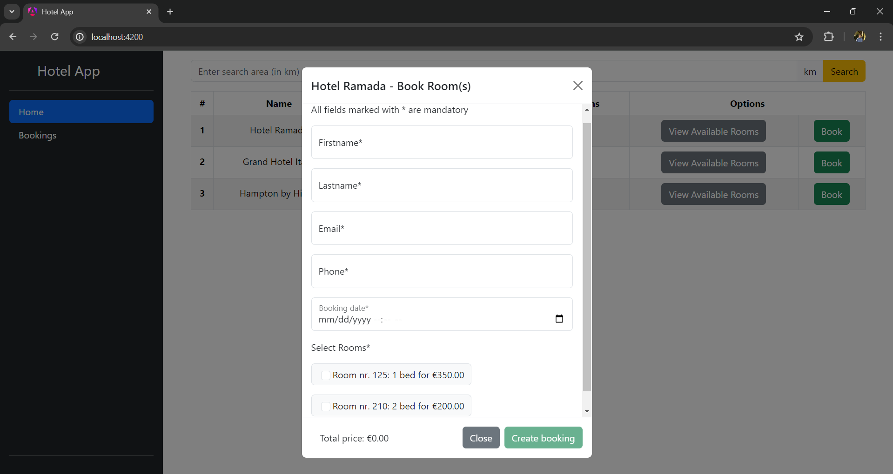
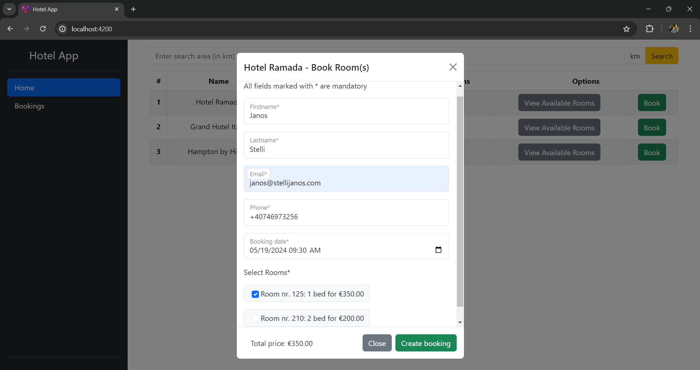
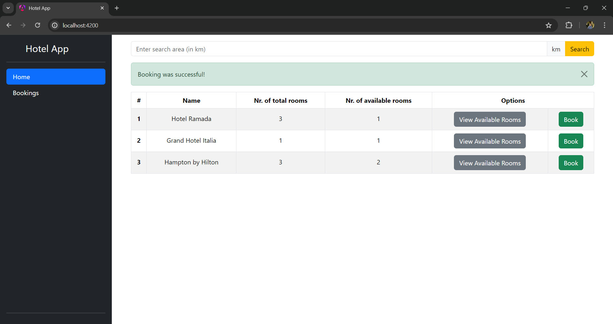
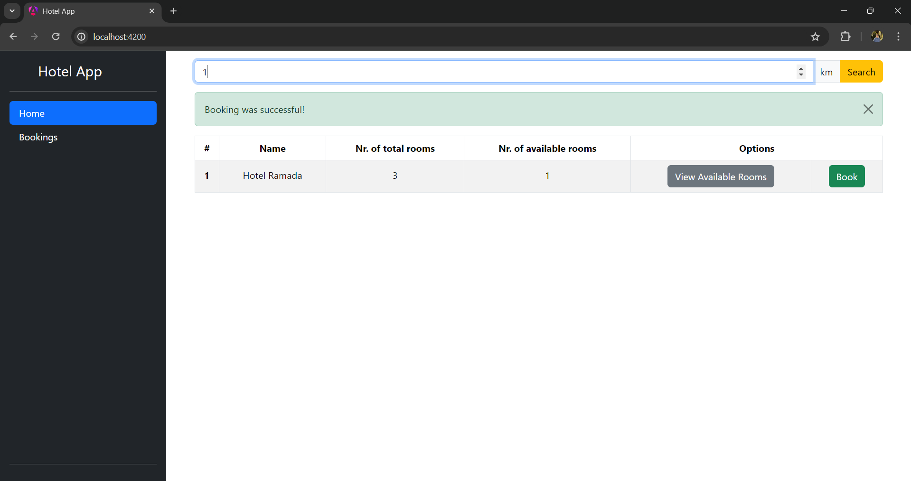

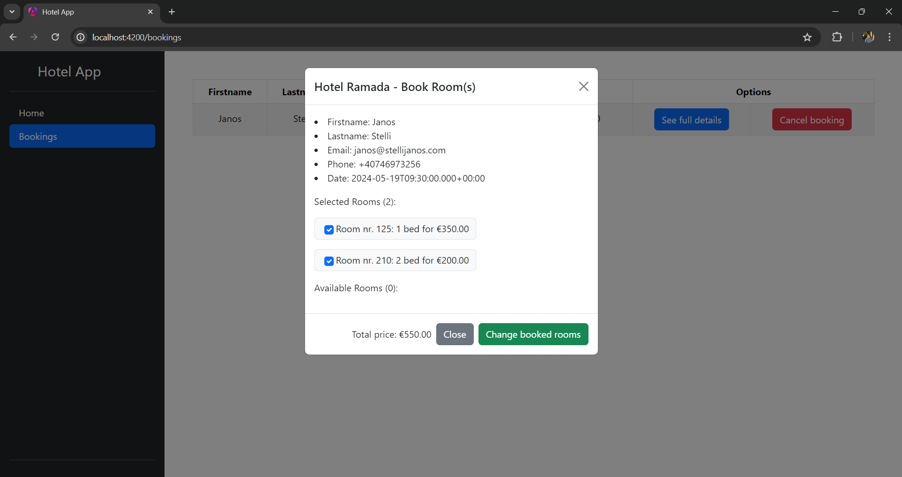
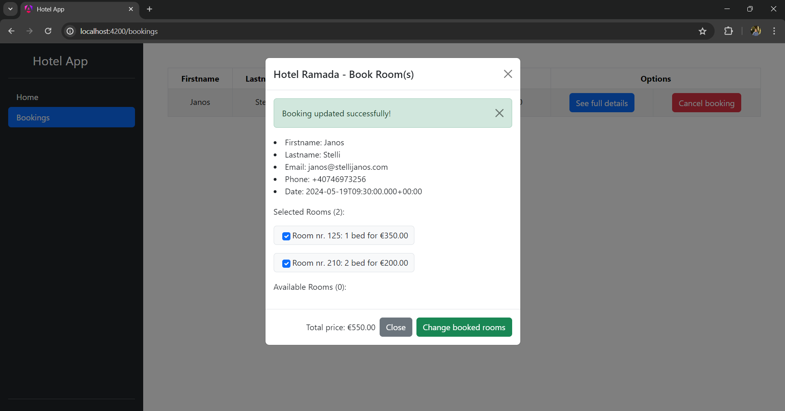
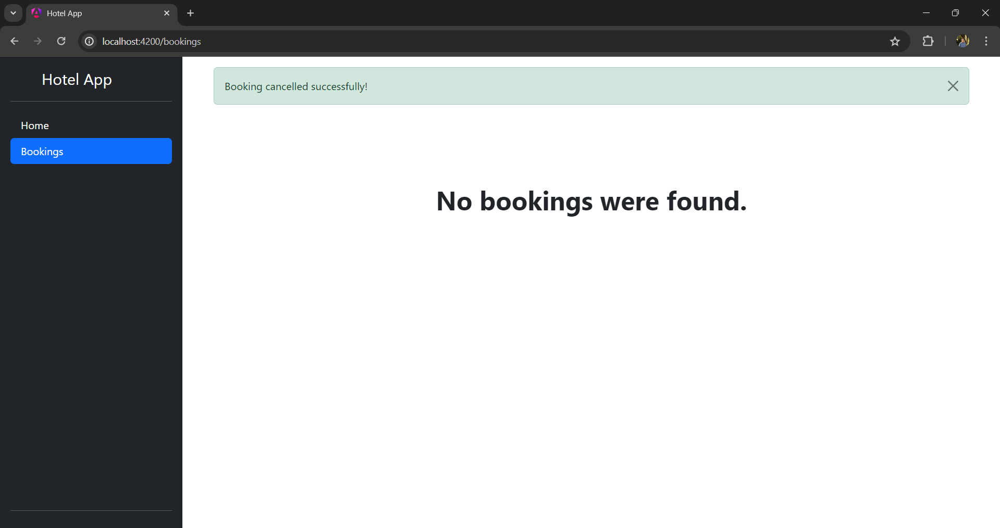
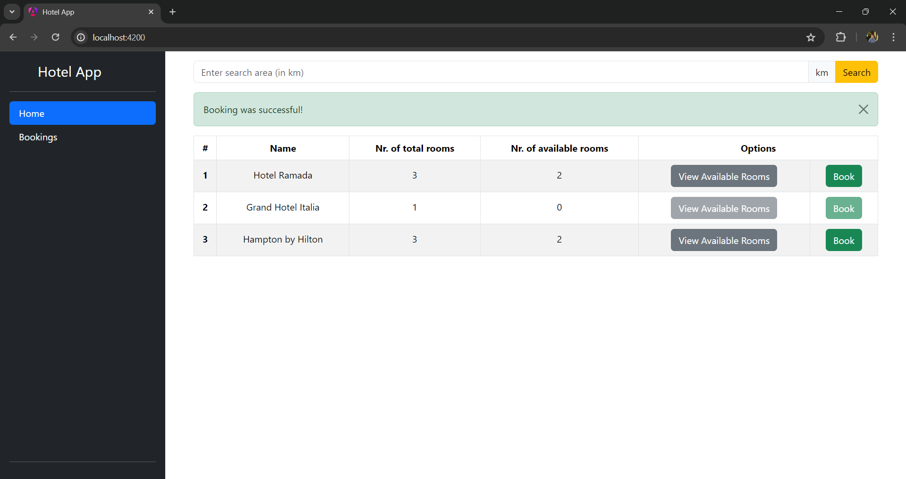
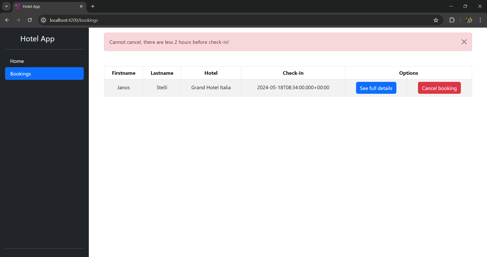
